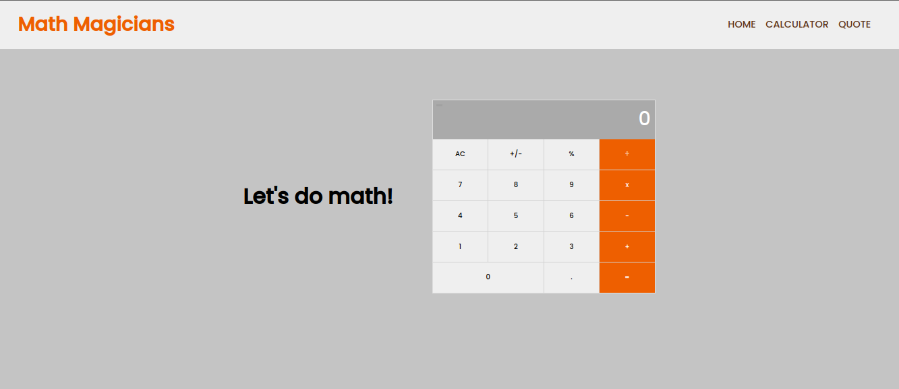

# Math magicians

This is a website for all fans of mathematics. It is a Single Page App (SPA) that allows users to:

- Make simple calculations.
- Read a random math-related quote.

## Technology used

- React
- JavaScript
- CSS
- JSX

## Live Demo

[Live Demo Link](https://6322f9cf91cf421178ea0051--polite-trifle-eb5c52.netlify.app/)  (Available)

### Getting Started

To get a local copy up and running follow these simple example steps.

- Clone the project unto your local machine
- Open the project with your code editor
- Run `npm install` to install all the dependencies
- Run `npm start` to start the server
- Open [http://localhost:3000](http://localhost:3000) to view it in the browser.

## Authors

👤 **Benjamin Kisenge (Me)**

* GitHub: [@benjamin kisenge](https://github.com/iambenkis)
* Twitter: [@benjamin kisenge](https://twitter.com/iambenkis)
* LinkedIn: [benjamin kisenge](https://www.linkedin.com/in/ben-kisenge/)

## 🤝 Contributing

Contributions, issues, and feature requests are welcome!

Feel free to check the [issues page](https://github.com/iambenkis/Math-Magicians-with-Reactjs/issues).

## Show your support

Give a ⭐️ if you like this project!

## Acknowledgments

- Microverse

## 📝 License

This project is [MIT](./LICENSE) licensed.

